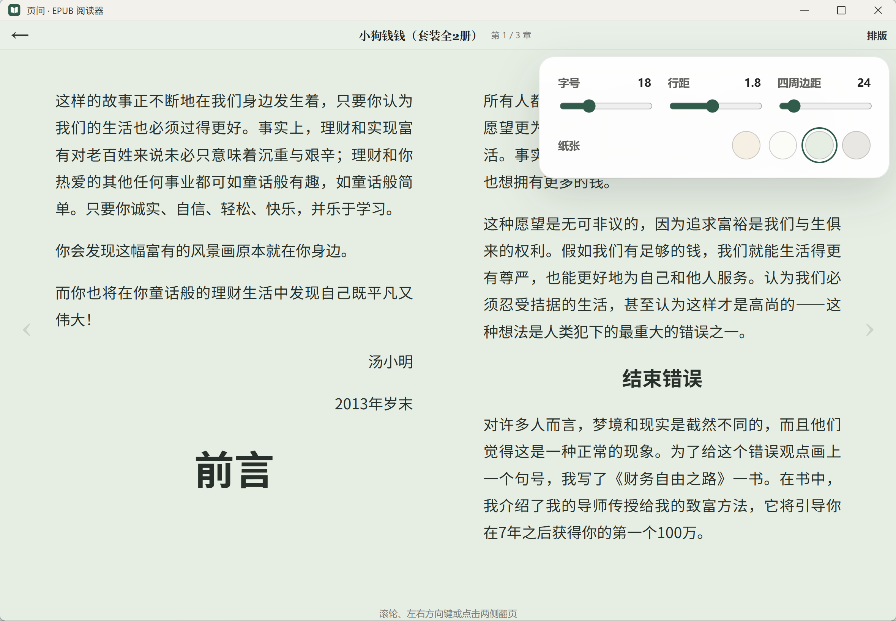
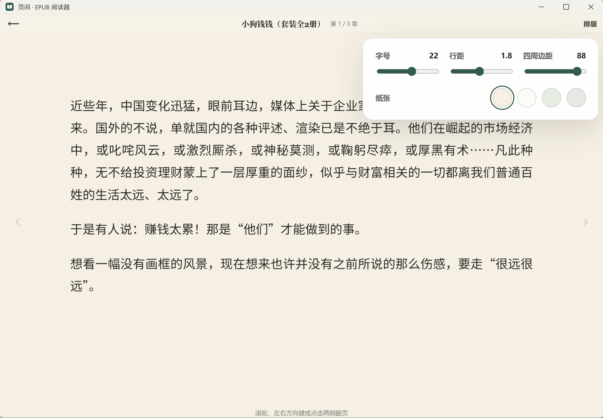

# 页间 · EPUB 阅读器

一个安静、轻巧、本地优先的 Windows EPUB 阅读器。


## 功能

- 本地导入 EPUB，自动读取封面、书名和作者
- 鼠标滚轮、左右方向键或点击页面两侧翻页
- 支持字号、行距、四周边距和纸张颜色调节
- 根据窗口与边距自动切换双栏或单栏排版
- 自动保存书架、阅读位置和排版偏好
- 无账号、无广告，不上传书籍

## 阅读与排版

| 阅读页 | 排版设置 |
| --- | --- |
|  |  |

## Windows 轻量版

`页间-1.0.4-Tauri轻量版.exe` 是单文件便携版，约 8.28 MB，无需安装，双击即可运行。

系统要求：Windows 10 / 11，并启用 Microsoft Edge WebView2 Runtime。多数现代 Windows 系统已自带。

## 本地开发

需要 Node.js、Rust 和 Tauri 的 Windows 构建环境。

```powershell
npm install
npm run dev
```

构建便携版：

```powershell
npm run package:tauri
```

生成文件位于 `release` 目录。

## 技术栈

- [Tauri](https://tauri.app/)
- [epub.js](https://github.com/futurepress/epub.js/)
- Vite
- IndexedDB

## 隐私

页间不包含账号、云同步、遥测或广告模块。导入的 EPUB、阅读进度及排版设置均保存在当前电脑中。

## 内容说明

本项目仅提供阅读器代码，不包含书源或电子书文件。请只阅读通过合法渠道获得的内容。

## 许可证

[MIT License](LICENSE)
