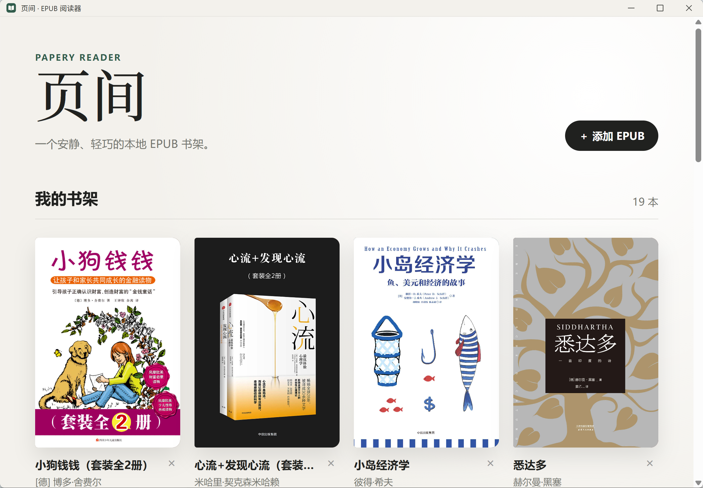

# 页间 · EPUB / TXT 阅读器

一个安静、轻巧、本地优先的阅读器。提供 Windows、Linux、Android 原生包与可安装 PWA。



## 在线体验

- [打开页间 PWA](https://mu-wan.github.io/papery-epub-reader/)
- 页面顶部提供“安装页间”，安卓、统信 UOS 与桌面 Chromium 可直接调起安装框
- 安装后可离线打开；书籍仍只保存在当前设备的浏览器中

## v1.1.3 功能

- 本地导入 EPUB 与 TXT，自动读取封面、书名和作者
- TXT 支持 UTF-8、BOM、GBK / GB18030，并自动识别常见中文章节
- 桌面支持滚轮、方向键和点击翻页；手机支持上下/左右滑动与系统返回手势
- 支持目录、字号、行距、独立横纵边距、霞鹜文楷等中文字体、纸色与纸张质感
- 按窗口宽度自动切换双栏或单栏排版
- 书架、在读与已完成分区，书卡显示真实阅读进度
- 可创建书盒整理书籍，支持桌面拖拽和手机长按拖动排序或移入书盒
- 所有轻量菜单支持点击外部关闭，并会自动避让视口、在短屏内独立滚动
- 最近一年阅读热力图，仅在书籍打开且应用位于前台时计时；统计双份保存并自动合并
- PWA 主动检查新版，接管后自动刷新并清理旧缓存
- 版本化 ZIP 备份，包含书籍、文件、书盒、进度与阅读统计
- 无账号、无广告、无遥测，不上传书籍

## 四端下载

[下载最新 Windows 便携版](https://github.com/Mu-Wan/papery-epub-reader/releases/latest)

- Windows：下载 `页间-1.1.3-Windows-便携版.exe`，双击运行
- Linux / 统信 UOS：优先下载 AppImage，也提供 DEB
- Android：下载 arm64 APK，允许安装来自浏览器的应用后直接安装
- PWA：打开上方在线体验地址，使用页面顶部“安装”入口

## 数据与备份

- Windows 版和 PWA 都把书籍与阅读数据保存在本机
- PWA 会在启动、首次操作和导入书籍时尝试申请持久存储；浏览器若仍拒绝，请定期从“管理”导出备份
- “合并恢复”保留本机内容，并采用较新的书籍状态
- “覆盖恢复”会先清空本机书架，操作前会再次确认
- 当前版本不提供账号或云同步，可用备份文件在设备间手动迁移

## 本地开发

需要 Node.js 22、Rust 和 Tauri 的 Windows 构建环境。

```powershell
npm install
npm run dev
```

构建 PWA：

```powershell
npm run build:web
```

构建 Windows 便携版：

```powershell
npm run package:tauri
```

生成的便携版位于 `release` 目录。

## 技术栈

- [Tauri](https://tauri.app/)
- [epub.js](https://github.com/futurepress/epub.js/)
- Vite / PWA
- IndexedDB

## 隐私与内容说明

页间不包含账号、云同步、遥测或广告模块。项目只提供阅读器代码，不包含书源或电子书文件；请只阅读通过合法渠道获得的内容。

## 许可证

[MIT License](LICENSE)

内置霞鹜文楷采用 [SIL Open Font License 1.1](public/licenses/LXGW-WenKai-OFL.txt)。
