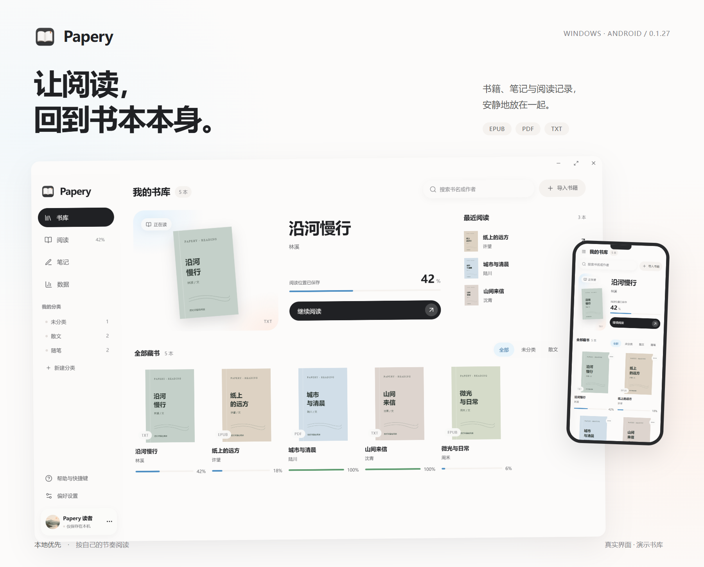
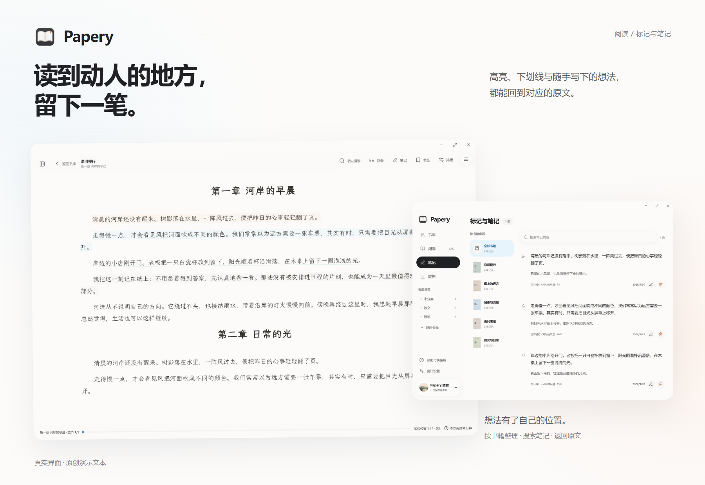
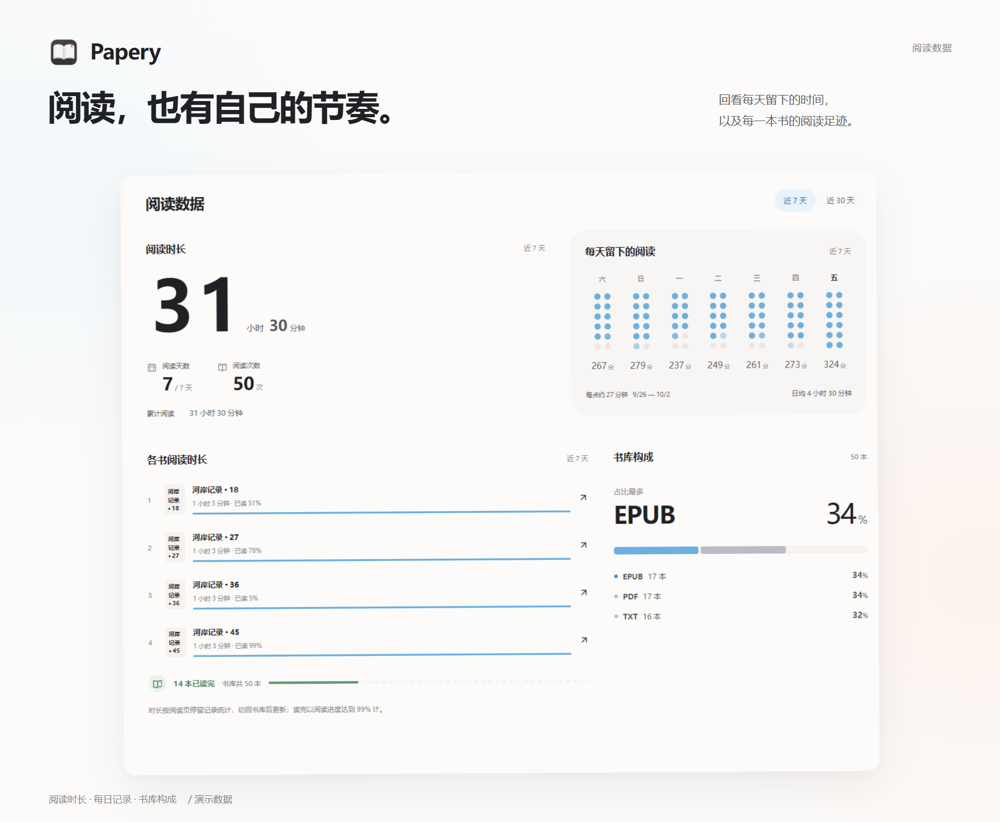

<strong>一个安静、本地优先的阅读空间。</strong> Windows · Android &nbsp; / &nbsp; EPUB · PDF · TXT

<a href="https://github.com/Mu-Wan/papery-epub-reader/releases/tag/papery-v0.1.43">下载 0.1.43</a> &nbsp; · &nbsp; <a href="https://mu-wan.github.io/papery-epub-reader/showcase/">项目主页</a> &nbsp; · &nbsp; <a href="docs/Google-Drive-接入.md">同步配置</a> &nbsp; · &nbsp; <a href="https://github.com/Mu-Wan/papery-epub-reader/issues">反馈问题</a>

## 从一本书开始

Papery 把书籍、阅读位置和随手写下的想法保存在本机。导入一本书，即可开始阅读；需要在设备之间接续时，再连接 Google Drive。

| 阅读 | 整理 | 回看 |
| --- | --- | --- |
| EPUB、TXT 调整字体、字号、行距与主题 | 真实封面、搜索、分类与分组 | 搜索笔记，回到原文 |
| 分页或连续滚动，PDF 缩放与页码定位 | 继续阅读、划线、书签与笔记 | 阅读时长、每日记录与格式分布 |

## 阅读与想法，在同一处

正文里的标注可以直接编辑、删除。笔记页可按时间、书籍、作者或标注类型分组，也可搜索书名、作者与章节。书架支持作者、书名首字母、出版年份和导入年份分组，并可分别设置组内排序。PDF 的左侧浮动工具可收起，把空间留给页面。

## 回看日常留下的阅读

用最近 7 天或 30 天的记录，看看阅读如何进入日常。时长、活跃日与书籍进度各有自己的位置；没有记录时，保留清楚的空状态。

展示图来自 0.1.28 演示界面，使用原创演示书籍与演示数据，安装包不附带这些内容。最新功能见 0.1.43 更新说明；窄屏画面为响应式布局预览。

## 下载与安装

| 平台 | 安装文件 | 环境 |
| --- | --- | --- |
| Windows | [下载 EXE 安装包](https://github.com/Mu-Wan/papery-epub-reader/releases/download/papery-v0.1.43/Papery-Reader-0.1.43-Windows-x64-Setup.exe) | x64，使用 WebView2 |
| Android | [下载 APK 安装包](https://github.com/Mu-Wan/papery-epub-reader/releases/download/papery-v0.1.43/Papery-Reader-0.1.43-Android-arm64.apk) | Android 7.0+，arm64 |

Windows 安装向导使用中文，程序名称为 **Papery Reader**。Android 更新沿用原签名。安装文件与 [SHA256 校验值](https://github.com/Mu-Wan/papery-epub-reader/releases/download/papery-v0.1.43/SHA256SUMS.txt) 均在 [0.1.43 发布页](https://github.com/Mu-Wan/papery-epub-reader/releases/tag/papery-v0.1.43) 提供。Windows 7 的实际设备兼容性尚未验证。

首次打开是空书库，默认昵称为“Papery 读者”，并配有默认头像。点击顶部“导入书籍”添加第一本书；点击侧栏底部**整条用户横栏**，即可修改个人资料或进入云同步。升级不会主动清空已有本地数据。

## 阅读操作

- 分页模式：方向键、PageUp / PageDown、空格、鼠标滚轮或正文左右区域翻页；手机支持横向滑动，Android 阅读时支持音量键翻页。
- EPUB 连续滚动跨章节接续；双页模式保持固定中缝，左右边距调整页面外侧空间。
- 工具栏：轻点正文中间区域显示或隐藏；收起后右上角按钮一并隐藏，工具栏开关不改变正文排版。PDF 左侧工具可收起。
- 沉浸阅读保留透明的章节、页码或阅读位置、当前时间与电量信息；设备未提供电量时显示“—”。
- 阅读定位：EPUB / TXT 保存内容位置，PDF 保存实际页码。可重排格式的屏幕分页随内容、排版与窗口大小变化。
- 本地备份：在偏好设置中导出或恢复完整书库。不开启同步也能正常阅读。

分类可通过悬停编辑按钮、双击名称或 F2 改名；手机端直接显示编辑和删除按钮。“未分类”位于末尾，分类不提供拖动排序。Windows 与 Android 共用版本 1 备份格式，迁移书籍原文件、封面、排版、个人资料、笔记与阅读记录；备份不包含 Google 连接配置或授权令牌。

[0.1.43 更新说明](docs/releases/0.1.43.md) · [备份格式与兼容性约定](docs/backup-format.md)

## 可选的 Google Drive 同步

点击侧栏底部用户横栏，切换到 **“云同步”**。只需客户端 ID，不需填写客户端密钥或部署登录服务。

1. 在 [Google Cloud 客户端](https://console.cloud.google.com/auth/clients) 创建 **Web 应用**客户端。
2. 在“已获授权的 JavaScript 来源”添加 **`https://mu-wan.github.io`**。只填来源，不加路径；本方案无需重定向 URI。
3. 在 Google Auth Platform 的目标对象中添加测试用户，数据访问权限添加 `https://www.googleapis.com/auth/drive.appdata`。
4. 在同一项目启用 [Google Drive API](https://console.cloud.google.com/marketplace/product/google/drive.googleapis.com)。
5. 填入客户端 ID，点击“使用 Google 连接”。浏览器会尝试直接打开 Google 官方授权窗口；若被拦截，再点击 Papery 连接页中的“继续到 Google”。授权后可自动返回、点击“返回 Papery”，或粘贴加密连接码。
6. 先在有书的设备同步，再在另一设备使用同一客户端 ID 与 Google 账号同步。

授权期间保持应用与同步面板打开。令牌仅保留在内存中，关闭应用或授权过期后需重新连接。书库存放在 Drive 的应用专用隐藏空间；完整书库同步会增加大型 PDF 的传输流量，首次同步前可导出本地备份。

[详细配置与常见问题 →](docs/Google-Drive-接入.md)

## 反馈与许可

通过 [Issues](https://github.com/Mu-Wan/papery-epub-reader/issues) 提供平台、版本、书籍格式与复现步骤。请勿上传私人书籍、客户端密钥或授权令牌。

代码许可见 [LICENSE](LICENSE)。
